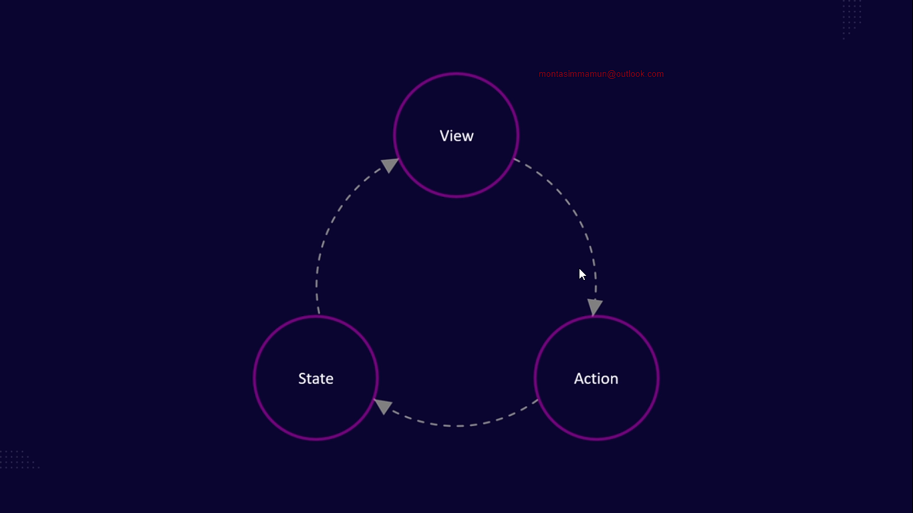

<hr/>

<br/>

<details>
    <summary> Text Instructions: Module 20 </summary>

```text
    Module_20_Published
   ```
</details>

## CONTENTS:

- [20-1: Get started with Redux. A deep dive into Redux's philosophy](#20-1-get-started-with-redux-a-deep-dive-into-reduxs-philosophy)
- [20-2: Inner working of redux](#20-2-inner-working-of-redux)
- [20-3: initialize react project](#20-3-initialize-react-project)
- [20-4: File Structure and routing](#20-4-file-structure-and-routing)
- [20-5: Setup redux store.](#20-5-setup-redux-store)
- [20-6 Setup first slice](#20-6-setup-first-slice)
- [20-7: Connect component with redux store](#20-7-connect-component-with-redux-store)
- [20-8: Actions, payload and business logic](#20-8-actions-payload-and-business-logic)
- [20-9: typescript best practice and devtool](#20-9-typescript-best-practice-and-devtool)
- [20-10: Middleware and custom middleware](#20-10-middleware-and-custom-middleware)
- [20-11: Module overview](#20-11-module-overview)

<br/>

### 20-1: Get started with Redux. A deep dive into Redux's philosophy

1. What is Redux?

	Redux is a predictable state containers for JavaScript applications.

	1. Predictable
   
       1. Single source of truth
       2. Immutable behavior
       3. Usage of pure function
       4. Object as a function
       5. Unidirectional flow

	2. State Containers
		
		1. 

   3. JavaScript Applications

		1. Works with any JavaScript applications

2. Why use Redux?

   1. Predictable state 
   2. Centralize state
   3. Debuggable: `Redux dev tools`
   4. Flexible
     	1. Independent UI Framework
     	2. Middleware support

3. Where not to use Redux?

	For small project Redux is not suitable because of it's complexity.

4. Redux alternative: `MobX`

<br/>

### 20-2: Inner working of redux

1. How Redux works?

   1. Action : Action taken by user. Each action has a corresponding reducer function.
   2. Dispatch: Sending the action object to the store. Dispatching an action triggers the corresponding reducer to update the state.
   3. Payload: Optional data that is attached to the action. It carries any additional information that needs to be sent along with the action to update the state.
   4. Reducer: A reducer is a pure function that takes the current state and an actions as inputs and return a new state. It defines how the application's state changes in response to different actions.
   5. Store: The store holds the state of the application. The store is responsible for dispatching actions, maintaining the state, and notifying subscribers about state changes.

   
   
   
   

<br/>

### 20-3: initialize react project

1. How to change server port for vite?

    ```javascript
    import { defineConfig } from 'vite'
    import react from '@vitejs/plugin-react'
    
    // https://vitejs.dev/config/
    export default defineConfig({
      plugins: [react()],
      server: {
        port: 3000,
      },
    })
    ```

2. How to disable system auto theme for vite?

	`Removes CSS` from `index.css`

<br/>

### 20-4: File Structure and routing

1. Setup react-router-dom

    `/src/main.tsx`
    
    ```javascript
    import React from 'react';
    import ReactDOM from 'react-dom/client';
    import './index.css';
    import {RouterProvider} from "react-router-dom";
    import routes from "./routes";
    
    ReactDOM.createRoot(document.getElementById('root')!).render(
      <React.StrictMode>
        <RouterProvider router={routes}/>
      </React.StrictMode>,
    )
    ```
    
    `/src/routes/index.tsx`
    
    ```javascript
    import {createBrowserRouter} from "react-router-dom";
    import App from "../App";
    
    const routes = createBrowserRouter([
        {
            path: "/",
            element: <App/>,
        },
        {
            path: "/home",
            element: <App/>,
        },
        {
            path: "/login",
            element: <App/>,
        },
    ]);
    
    export default routes;
    ```
    
    `/src/App.tsx`
    
    ```javascript
    function App() {
      return (
        <>
          <h1 className='bg-red-500'>Tech Net</h1>
        </>
      )
    }
    
    export default App;
    
    ```

<br/>

### 20-5: Setup redux store.


<br/>

### 20-6 Setup first slice


<br/>

### 20-7: Connect component with redux store


<br/>

### 20-8: Actions, payload and business logic


<br/>

### 20-9: typescript best practice and devtool


<br/>

### 20-10: Middleware and custom middleware

1. Do not overwrite the default middleware of `Redux`

    ```javascript
    middleware: (getDefaultMiddleware) => getDefaultMiddleware().concat(logger),
    ```
   
2. How to create custom middleware?

    `src/redux/middleware/logger.ts`
    
    ```typescript
    import {Middleware} from "@reduxjs/toolkit";
    
    const logger: Middleware = (store) => (next) => (action) => {
        console.log('Current State', store.getState());
        console.log('ACtion', action);
    
        next(action);
    
        console.log('Updated State', store.getState());
    }
    
    export default logger;
    ```
    
    `src/redux/store.ts`
    
    ```typescript
    import {configureStore} from '@reduxjs/toolkit';
    import counterReducer from './features/counter/counterSlice';
    import logger from "./middleware/logger";
    
    const store = configureStore({
        reducer: {
            counter: counterReducer,
        },
        // devTools: true,
        middleware: (getDefaultMiddleware) => getDefaultMiddleware().concat(logger),
    });
    
    export type RootState = ReturnType<typeof store.getState>
    export type AppDispatch = typeof store.dispatch
    
    export default store;
    ```

	[Learn More Here](https://redux.js.org/understanding/history-and-design/middleware)

<br/>

### 20-11: Module overview

<br/>

## Redux

> Redux is a predictable state container for JavaScript apps.

* Single source of truth
* Immutable behavior
* Usage of pure function
* Object as a action
* Unidirectional flow

### Redux 
* React Redux - Old way of using redux
* Redux Toolkit
    * RTK Query

### Factor why redux is used/popular
* Predictable state management
* Centralized state management
* Easy debugging
* Flexible
    * Independent UI framework
    * Middleware support

### Redux Flow
> Action: An action taken by user. Each action has a corresponding reducer function.
 
> Dispatch: Sending the action object to the store. Dispatching an action triggers the corresponding reducer to update the state.

> Payload: Optional data that is attached to an action. It carries any additional information that needs to be send along with the action to update the state.

> Reducer: A reducer is a pure function that takes the current state and an action as inputs and returns a new state. It defines how application's state changes in response to different actions.

> Store: The store holds the state of the application. The store is responsible for dispatching actions, maintaining the state, and notifying subscribers about state changes.

