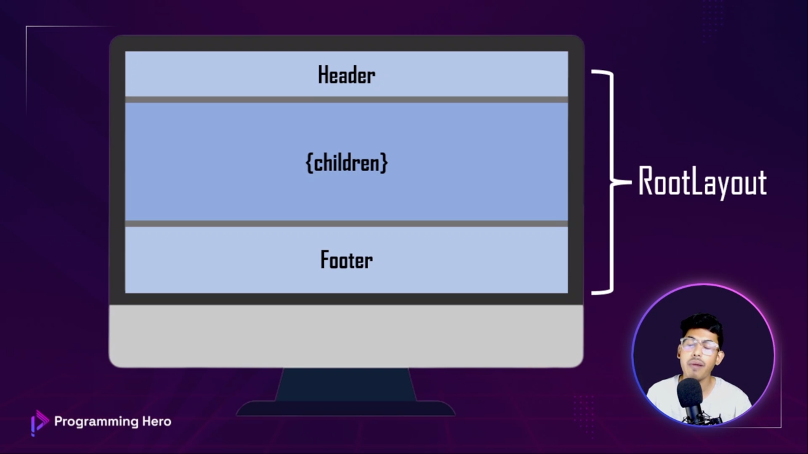
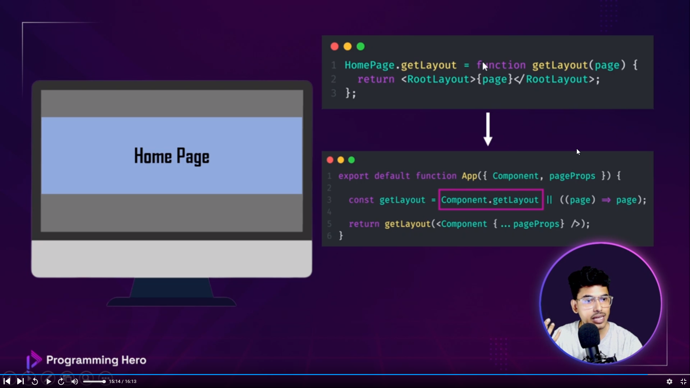
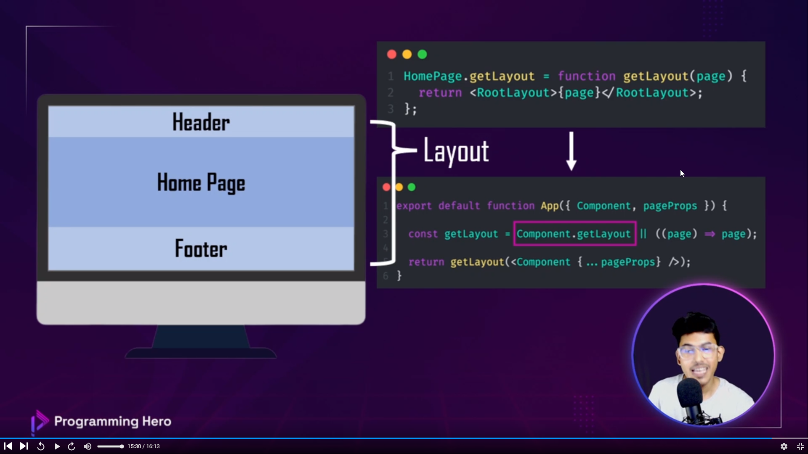
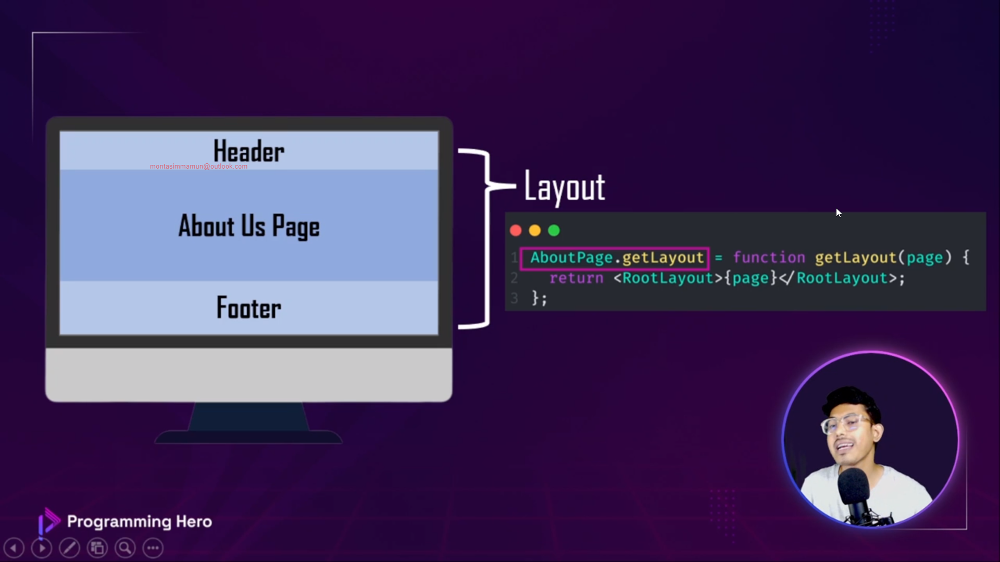
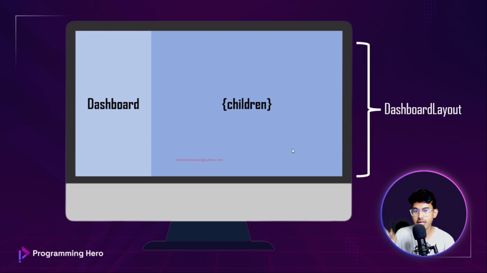
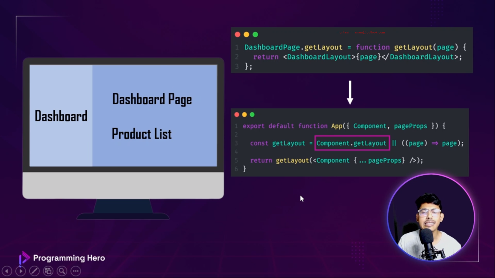
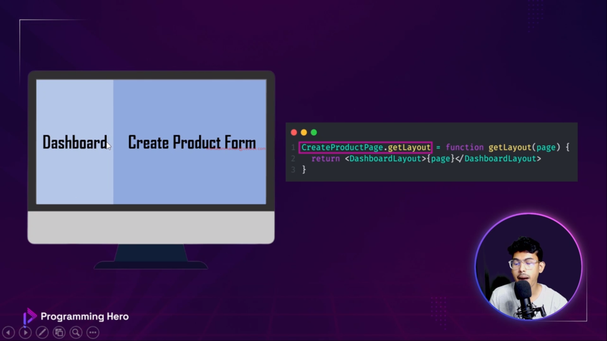
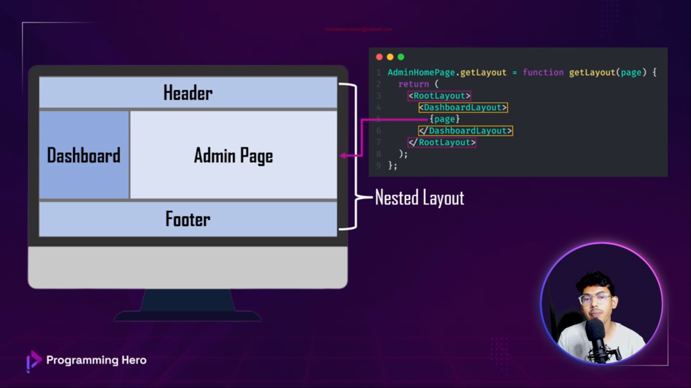
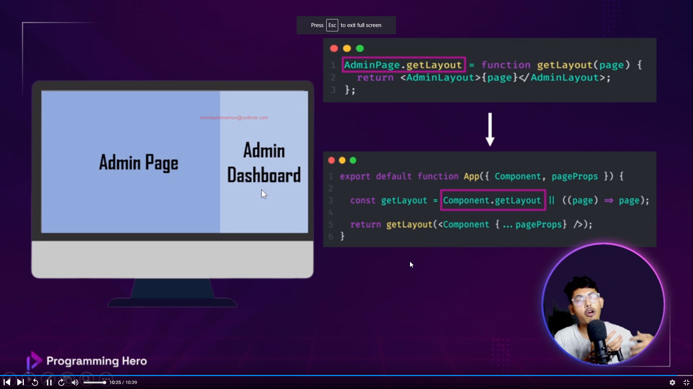

<hr/>

<br/>

<details>
    <summary> Text Instructions Let's Start Our Journey With NextJs </summary>

```text
    তোমার প্রথম প্রেম জাভাস্ক্রিপ্ট। দ্বিতীয় প্রেম React আর তৃতীয় প্রেম হলো Next.Js !!! (মডিউল 24)
    
    #module_release
    
    #mission_be_a_nextjs_ninja
    
    #module_24  
    
    
    
    আজকে তোমার জন্য স্বরনীয় দিন। আজকে থেকে তুমি তোমার জীবনের নতুন দিগন্ত শুরু করতে যাচ্ছ। খুবই এক্সসাইটিং আর খুবই ইন্টারেস্টিং এই জার্নি হবে তোমার। এই মডিউল দিয়েই শুরু হচ্ছে Next.Js Ninja হওয়ার মিশনInstall Next.Js: নিচে তিনটা কমান্ড দিয়ে দিলাম কি আছে জীবনে।
    
    
    
    npx create-next-app@latest my-next-app  
    
    cd my-next-app  
    
    npm run dev  
    
    
    
    আজকের মডিউল:   খুবই গুরুত্বপূর্ণ কিছু কথাবার্তা হবে আজকের মডিউলে। জাস্ট ১০টা-১১টা ভিডিও।  এর মধ্যে থাকবে--  ১. Next.Js কি? ২. React এর পরিবর্তে কেন Next.Js ব্যবহার করবো? ৩. ক্লায়েন্ট সাইড, সার্ভার সাইড, pre-rendering কি?৪. Next.Js এর key ফিচারস গুলো নিয়ে আলোচনা করবো।  ৫. আর! নো নো সব যদি এখানেই বলে দেয়ই তাহলে তো ভিডিও দেখার মজাই নস্ট হয়ে গেলো সো জলদি শুরু করে দাও
    
    
    
    তোমার এই মিশন মিশন ৫ এর টেনটেটিভ আউটলাইনঃ   
    
    18th July, Tuesday: Module-24: Fundamentals of Next.Js 
    
    20th July, Thursday: Module-25: Next Level Data Fetching in Next.Js
    
    23rd July, Sunday: Module-26: Explore NextAuth & App Router
    
    25th July, Tuesday: Module-26.5: Practice Day  
    
    27th July, Thursday: Module-27: Assignment-6
    
    
    
    শুরু হলো, এ রোমান্টিক রিলেশন উইথ Next.Js  লেগে থাকলে কত কি যে হবে!! এখানেই নয় তো শেষ!
   ```
</details>

## CONTENTS:

- [24-1. Let's Start Our Journey With NextJs](#24-1-lets-start-our-journey-with-nextjs)
- [24-2. Why Next.Js? The Competitive Edge of Next.Js over React.Js](#24-2-why-nextjs-the-competitive-edge-of-nextjs-over-reactjs)
- [24-3: Clear concept of Pre-rendering and Client side rendering](#24-3-clear-concept-of-pre-rendering-and-client-side-rendering)
- [24-4: Exploring the World of Next.Js Project Creation and Its Folder Structure](#24-4-exploring-the-world-of-nextjs-project-creation-and-its-folder-structure)
- [24-5: Key features of Next.Js with File based routing system](#24-5-key-features-of-nextjs-with-file-based-routing-system)
- [24-6: Exploring Dynamic Routes and Nested Routing](#24-6-exploring-dynamic-routes-and-nested-routing)
- [24-7: Catch all routes and custom 404 error page also Add CSS Component library](#24-7-catch-all-routes-and-custom-404-error-page-also-add-css-component-library)
- [24-8: Navigation with Link Component and Programmatically Navigating](#24-8-navigation-with-link-component-and-programmatically-navigating)
- [24-9.1: Explore Simple Layout System](#24-91-explore-simple-layout-system)
- [24-9.2: Explore Dashboard & Nested Layout System](#24-92-explore-dashboard--nested-layout-system)
- [24-10: Using Head Component for better SEO, Image Component, import alias and Module summary](#24-10-using-head-component-for-better-seo-image-component-import-alias-and-module-summary)

<br/>

### 24-1. Let's Start Our Journey With NextJs

1. What is Next.js?  
   1. A React framework for the web
   2. `React with superpower`
2. What is Next.js's superpower?
   1. Automatic image, font and script optimizations for improved UX and core web vitals
   2. Pre-rendering (`SSG + SSR`) for blazing fast application
   3. Next level data fetching (data fetching methods runs on the server)
   4. Powerful routing and layouts
   5. Build complex interfaces and ship less JavaScript
   6. Has file system based router built on concepts of pages and can share nested layouts
   7. API routes (Build API endpoint to securely connect with third party services)

<br/>

### 24-2. Why Next.Js? The Competitive Edge of Next.Js over React.Js

1. Why Next.js?
   > Next.js is React.js's partners/combiners`
2. The competitive edge of Next.js over React.js
   1. React.js is a library. Next.js is a framework
   2. Use Next.js for Full-Stack application development
      
   3. Next.js is amazingly fast because of pre-rendering
   4. SEO friendly
3. What is rendering?
	> Process of turning HTML, CSS and JavaScript into an interactive page
   
	

<br/>

### 24-3: Clear concept of Pre-rendering and Client side rendering

1. Client side rendering
   > Rendering on the runtime
2. Pre-rendering
   > Generated when building and served when requested
   1. Static Site Generation (SSG)
   		1. Generated on build time served when requested
   2. Server Side Rendering (SSR)
   		1. Generated dynamically and served based on the request

<br/>

### 24-4: Exploring the World of Next.Js Project Creation and Its Folder Structure

1. Next.js follows 2 types of folder structure
	1. Pages router
    2. App router (stable) 
       ```Creating components using app router will be server component that will be generated from server. This server components has limited CSS components library supports```

<br/>

### 24-5: Key features of Next.Js with File based routing system

1. What's in Next.js?
	1. Build in optimizations
   		1. Image optimization (converts to small size but maintains same resolution)
	2. 	Dynamic HTM<L streaming
   3. React server components
   4. Data fetching
   5. CSS supports ```Same CSS can be used on different components but style will not overwrite```
   6. Client and server side rendering
   7. Node.js and Edge runtimes
   8. Route handlers
   9. Powerful routing and layouts
   10. Middleware
2. File based routing system
	```Create a new file inside the pages folder and a new route will be created using the file name```

<br/>

### 24-6: Exploring Dynamic Routes and Nested Routing

<br/>

### 24-7: Catch all routes and custom 404 error page also Add CSS Component library

1. Dynamic routes

    ```text
    File name: [fileName].js
    ```
    
    ```javascript
    // dynamic route
    import {useRouter} from "next/router";
    
    const NewsDetails = () => {
        const router = useRouter();
        return (
            <div>
                <h1>This is details page of: {router.query.newsId}</h1>
            </div>
        );
    };
    
    export default NewsDetails;
    ```

2. Catch all routes after dynamic route `[...slug].js`

3. Custom 404 page

    ```text
    File name: 404.js
    ```
   
    ```javascript
    const NotFound = () => {
        return (
        <div>
            
        </div>
        );
    };
        
    export default NotFound;
    ```
<br/>

### 24-8: Navigation with Link Component and Programmatically Navigating

1. How to use Link in Next.js

    ```javascript
     import {Button} from "antd";
    import Link from "next/link";
    
    const NewsPage = () => {
        return (
            <div>
                <Button type="primary">
                    <Link href='/'>
                        Back to Home
                    </Link>
                </Button>
            </div>
        );
    };
    
    export default NewsPage;
    ```

2. Automatically redirect user to home page from 404 page after 5 seconds in Nest.js

    ```javascript
    import {useRouter} from "next/router";
    
    const NotFound = () => {
        const router = useRouter();
    
        setTimeout(() => {
            router.push('/')
        }, 5000);
    
        return (
            <div>
                
            </div>
        );
    };
    
    export default NotFound;
    ```

<br/>

### 24-9.1: Explore Simple Layout System






1. Per-Page Layouts:

    If you need multiple layouts, you can add a property getLayout to your page, allowing you to return a React component for the layout. This allows you to define the layout on a per-page basis. Since we're returning a function, we can have complex nested layouts if desired.
    
    ```text
    pages/index.js
    ```
    
    ```javascript
    import Layout from '../components/layout'
    import NestedLayout from '../components/nested-layout'
     
    export default function Page() {
      return (
        /** Your content */
      )
    }
     
    Page.getLayout = function getLayout(page) {
      return (
        <Layout>
          <NestedLayout>{page}</NestedLayout>
        </Layout>
      )
    }
    ```
   
    <hr/>

    ```text
    pages/_app.js
    ```
    
    ```javascript
    export default function MyApp({ Component, pageProps }) {
      // Use the layout defined at the page level, if available
      const getLayout = Component.getLayout || ((page) => page)
     
      return getLayout(<Component {...pageProps} />)
    }
    ```

<br/>

### 24-9.2: Explore Dashboard & Nested Layout System

1. Per-Page Layouts





2. Nested Layouts

   

3. Position admin dashboard on the right side

   

   If you need multiple layouts, you can add a property getLayout to your page, allowing you to return a React component for the layout. This allows you to define the layout on a per-page basis. Since we're returning a function, we can have complex nested layouts if desired.

   ```text
   src/components/Layouts/DashboardLayout.js
   ```

   ```javascript
   import React, { useState } from 'react';
   import {
       DesktopOutlined,
       FileOutlined,
       PieChartOutlined,
       TeamOutlined,
       UserOutlined,
   } from '@ant-design/icons';
   import { Breadcrumb, Layout, Menu, theme } from 'antd';
   const { Header, Content, Footer, Sider } = Layout;
   function getItem(label, key, icon, children) {
       return {
           key,
           icon,
           children,
           label,
       };
   }
   const items = [
       getItem('Option 1', '1', <PieChartOutlined />),
       getItem('Option 2', '2', <DesktopOutlined />),
       getItem('User', 'sub1', <UserOutlined />, [
           getItem('Tom', '3'),
           getItem('Bill', '4'),
           getItem('Alex', '5'),
       ]),
       getItem('Team', 'sub2', <TeamOutlined />, [getItem('Team 1', '6'), getItem('Team 2', '8')]),
       getItem('Files', '9', <FileOutlined />),
   ];
   const DashboardLayout = ({children}) => {
       const [collapsed, setCollapsed] = useState(false);
       const {
           token: { colorBgContainer },
       } = theme.useToken();
       return (
           <Layout
               style={{
                   minHeight: '100vh',
               }}
           >
               <Sider collapsible collapsed={collapsed} onCollapse={(value) => setCollapsed(value)}>
                   <div className="demo-logo-vertical" />
                   <Menu theme="dark" defaultSelectedKeys={['1']} mode="inline" items={items} />
               </Sider>
               <Layout>
                   <Header
                       style={{
                           padding: 0,
                           background: colorBgContainer,
                       }}
                   />
                   <Content
                       style={{
                           margin: '0 16px',
                       }}
                   >
                       <Breadcrumb
                           style={{
                               margin: '16px 0',
                           }}
                       >
                           <Breadcrumb.Item>User</Breadcrumb.Item>
                           <Breadcrumb.Item>Bill</Breadcrumb.Item>
                       </Breadcrumb>
                       <div
                           style={{
                               padding: 24,
                               minHeight: 360,
                               background: colorBgContainer,
                           }}
                       >
                           {children}
                       </div>
                   </Content>
               </Layout>
           </Layout>
       );
   };
   export default DashboardLayout;
   ```
   <hr/>

   ```text
   src/components/Layouts/RootLayout.js
   ```

   ```javascript
   import { Breadcrumb, Layout, Menu, theme } from 'antd';
   const { Header, Content, Footer } = Layout;
   
   const RootLayout = ({children}) => {
       const {
           token: { colorBgContainer },
       } = theme.useToken();
   
       return (
           <Layout className="layout">
               <Header
                   style={{
                       display: 'flex',
                       alignItems: 'center',
                   }}
               >
                   <div className="demo-logo" />
                   <Menu
                       theme="dark"
                       mode="horizontal"
                       defaultSelectedKeys={['2']}
                       items={new Array(15).fill(null).map((_, index) => {
                           const key = index + 1;
                           return {
                               key,
                               label: `nav ${key}`,
                           };
                       })}
                   />
               </Header>
               <Content
                   style={{
                       padding: '0 50px',
                   }}
               >
                   <Breadcrumb
                       style={{
                           margin: '16px 0',
                       }}
                   >
                       <Breadcrumb.Item>Home</Breadcrumb.Item>
                       <Breadcrumb.Item>List</Breadcrumb.Item>
                       <Breadcrumb.Item>App</Breadcrumb.Item>
                   </Breadcrumb>
                   <div
                       className="site-layout-content"
                       style={{
                           background: colorBgContainer,
                           height: '100vh'
                       }}
                   >
                       {children}
                   </div>
               </Content>
               <Footer
                   style={{
                       textAlign: 'center',
                   }}
               >
                   Ant Design ©2023 Created by Ant UED
               </Footer>
           </Layout>
       );
   };
   
   export default RootLayout;
   ```
   <hr/>

    ```text
    pages/admin.js
    ```

    ```javascript
    import DashboardLayout from "../../components/Layouts/DashboardLayout";
    import RootLayout from "../../components/Layouts/RootLayout";
   
    const AdminHomePage = () => {
        return (
            <div>
                <h1>Admin Page Without Layout</h1>
            </div>
        );
    };
   
    export default AdminHomePage;
   
    AdminHomePage.getLayout = function getLayout(page) {
        return (
            <RootLayout>
                <DashboardLayout>
                    {page}
                </DashboardLayout>
            </RootLayout>
        )
    };
    ```

    <hr/>

    ```text
    pages/_app.js
    ```

    ```javascript
    export default function MyApp({ Component, pageProps }) {
      // Use the layout defined at the page level, if available
      const getLayout = Component.getLayout || ((page) => page)
     
      return getLayout(<Component {...pageProps} />)
    }
    ```

<br/>

### 24-10: Using Head Component for better SEO, Image Component, import alias and Module summary

1. How to import on Next.js
   1. Relative path `../components/Layouts/RootLayout.js`
   2. Absolute path `@/components/Layouts/RootLayout.js`
2. Next.js uses `Head` components for SEO friendly website
3. Use Next.js <title> instead of react-helmet
   
   ```javascript
   <Head>
      <title>Next Home Page</title>
      <meta name='Home page' description='This page is created by Next.js'/>
   </Head>
   ```
4. When using [Image in Next.js](https://nextjs.org/docs/pages/api-reference/components/image-legacy) remember the followings
   1. Image `<Image width={} height={} src='' alt=''/>` component must include `width` and `height` property
   2. When using external image in Next.js configure the `hostname` in `next.config.js`
   3. When using local image no need to configure the `hostname` in `next.config.js`

<br/>